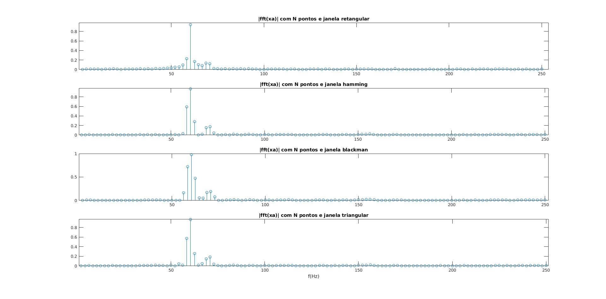

# TAREFA: Análise espectral de uma dada sequência

Sabe-se que as sequências `xa(n)` e `xb(n)` resultaram da amostragem de dois sinais de tempo contínuo a uma frequência `fs=500Hz`. Deseja-se obter um modelo (expressão matemática) para cada um desses sinais de tempo contínuo.

1. Inicialmente, carregue no MATLAB o sinal `xa(n)` disponível no arquivo `xa.mat` ao final da página. Sugestão de script:

	```Matlab
	fs=500; % Frequência de amostragem
	load xa.mat;
	x=xa;
	N=length(x);
	n=0:N-1;
	figure(1)
	stem(n,x); title('sinal de tempo discreto'); 
	xlabel('n')
	```
2. A partir da sequência `x`, crie quatro outras sequências janeladas. Sugestão de script:
	
	```Matlab
	xretangular=x;
	xhamm=x.*hamming(N)'*N/sum(hamming(N));
	xblac=x.*blackman(N)'*N/sum(blackman(N));
	xtriang=x.*triang(N)'*N/sum(triang(N));
	```
3. Faça a `fft` para uma das sequências janeladas com `N` pontos.

    **Resposta:**
    
    ```Matlab
	out_reta = fft(x, N);
	out_hamm = fft(xhamm, N);
	out_blac = fft(xblac, N);
	out_tria = fft(xtriang, N);
	```
4. Visualize o módulo de cada uma das `fft`s. Para facilitar a comparação, crie a tela gráfica `figure(2)` e divida-a em 4 linhas e 1 coluna com o comando `subplot`.

	Use os fatores de escala adequados para ler diretamente no eixo das abscissas as frequências cíclicas (em Hz) e no eixo das ordenadas o valor da magnitude do sinal.
    
     **Resposta:**
    
    ```Matlab
	w = (fs/N)*n;
    out_reta_n = (2/N)*out_reta;
    out_hamm_n = (2/N)*out_hamm;
    out_blac_n = (2/N)*out_blac;
    out_tria_n = (2/N)*out_tria;
    figure(2)
    subplot(4, 1, 1); stem(w(1:N/2+1), abs(out_reta_n(1:N/2+1))); 
    title ('|fft(xa)| com N pontos e janela retangular');
    subplot(4, 1, 2); stem(w(1:N/2+1), abs(out_hamm_n(1:N/2+1))); 
    title ('|fft(xa)| com N pontos e janela hamming');
    subplot(4, 1, 3); stem(w(1:N/2+1), abs(out_blac_n(1:N/2+1))); 
    title ('|fft(xa)| com N pontos e janela blackman');
    subplot(4, 1, 4); stem(w(1:N/2+1), abs(out_tria_n(1:N/2+1))); 
    title ('|fft(xa)| com N pontos e janela triangular'); 
    xlabel('f(Hz)')
	```
    

5. A partir dessas figuras, estime os valores das componentes senoidais que formam o sinal de tempo contínuo correspondente à sequência `xa(n)`, ou seja,  `xa(t)`.

	Na sua opinião, qual é o melhor resultado?
    
    **Resposta:**
   
    Como podemos ver pela imagem acima (ajustei o intervalo de `f` para que seja apresentadas apenas amostras de frequências inferiores a `fs/2`) a provável forma do sinal `xa(t)` é `xa(t) = cos(2*pi*60[Hz]*t) + 0.2*cos(2*pi*70[Hz]*t)`.
    O melhor resultado para detecção da frequência de maior amplitude (`60[Hz]`) foi do fft com a janela retangular, pois gerou os menores lóbulos secundários. Já para a frequência de de menor amplitude (`70[Hz]`) o melhor resultado foram os da janela de Hamming e da triangular, pois deixaram mais evidente que essa frequência não é só um lóbulo secundário da frequência dominante.
    
6. A fim de ter um pouco mais de certeza em sua resposta, sugere-se incluir mais pontos na `fft`. Sendo assim, refaça as `fft`s do item 3 com 1024 pontos. 	
	Novamente, para facilitar a comparação, crie a tela gráfica `figure(3)` e divida-a em 4 linhas e 1 coluna com o comando `subplot`.
	
	Use os fatores de escala adequados para ler diretamente no eixo das abscissas as frequências cíclicas (em Hz) e no eixo das ordenadas o valor da magnitude do sinal.

	Dica de script para o caso da janela retangular:

	```Matlab
	Kt=1024;
	X_1024R=(2/N)*fft(xretangular,Kt);
	k1024=(fs)*[0:Kt-1]/Kt;
	```
7. A partir dessas figuras, estime novamente os valores das componentes senoidais que formam o sinal `xa(t)`.
8. Compare o resultado do item 7 com o do caso da `fft` com apenas `N` pontos. Justifique adequadamente sua conclusão.
9. Repita os itens anteriores para a sequência  xb(n). Dica de script:

	```Matlab
	load xb.mat;  
	x=xb;
	```