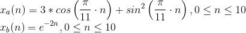
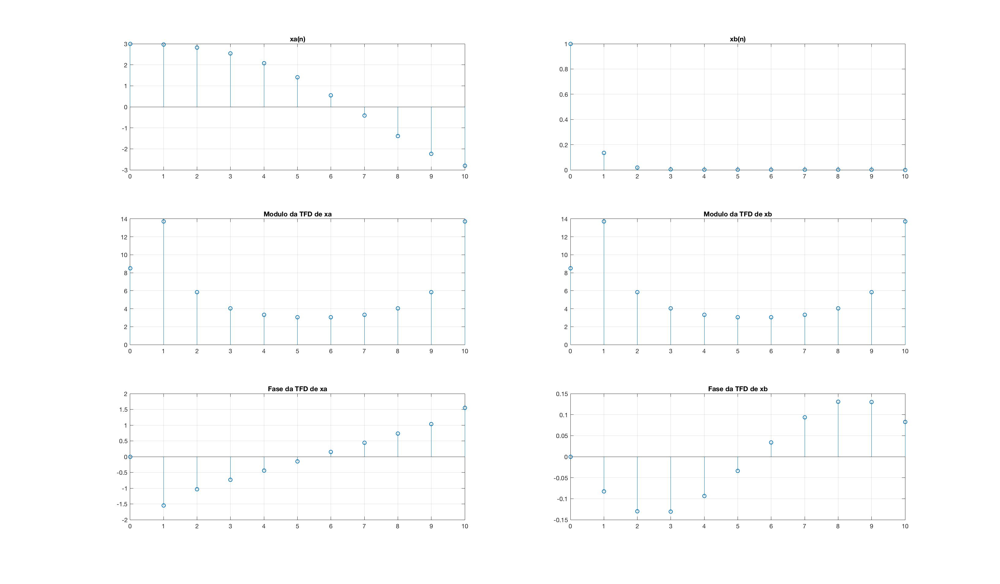
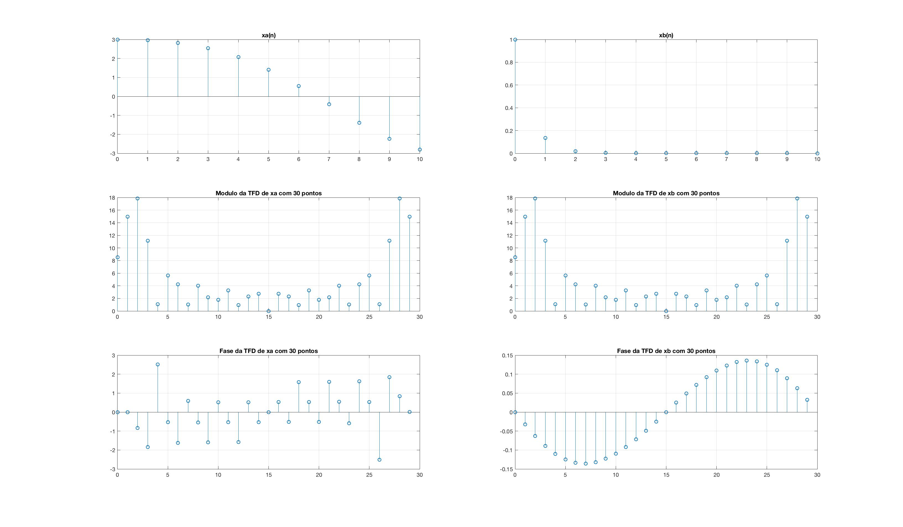
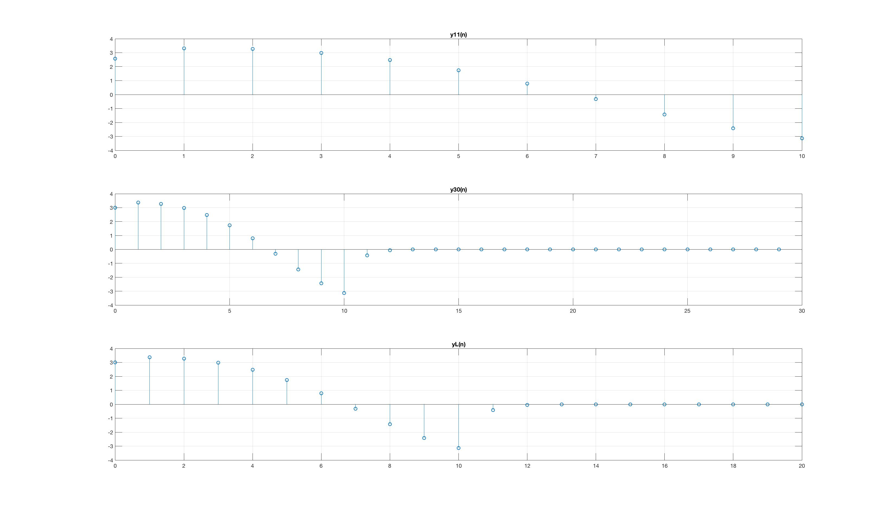
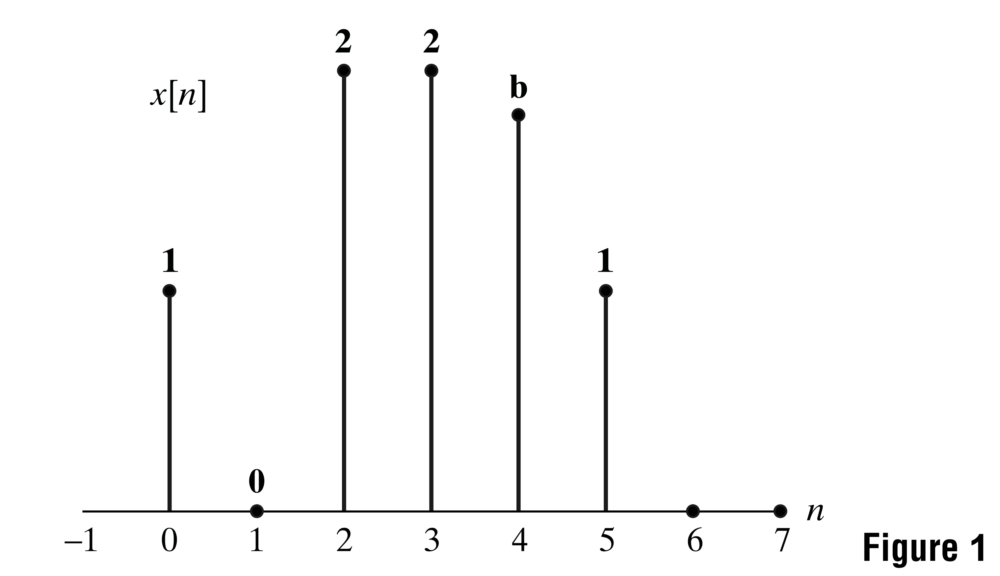
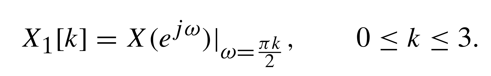
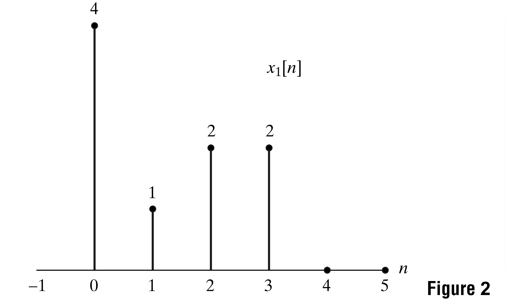
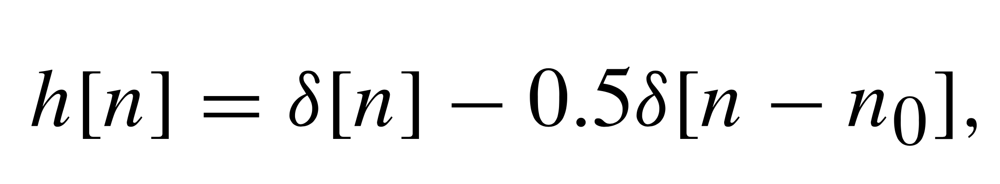

# Tarefa 3

## Exercício 1
Sejam as sequências de tempo discreto



Pede-se:

### __(a)__ 
Determine analiticamente a expressão da TFD para cada um desses sinais supondo `N = 11`. Em outras palavras, explicite a função resultante e determine os valores de `Xa(k) = TFD{xa(n)}` e `Xb(k) = TFD{xb(n)}` para `0 <= k <= 10` inteiro. 

#### __i.__ 
Use a função fft do MATLAB para obter `Xa(k)` e `Xb(k)` para `0 <= k <= N-1` inteiro

**DICA**: para cada um dos sinais, sugerem-se os comandos abaixo.

```matlab
X = fft(x, N);
k = 0:N-1;
figure(1)
subplot(311); stem(n, x); grid
title('x(n)')
subplot(312); stem(k, abs(X)); grid
title('Modulo da TFD')
subplot(313); stem(k, angle(X)); grid
title('Fase da TFD')
```
__Resposta__:

```matlab
% variáveis de domínio
N = 11;
n = 0:N-1;
k = 0:N-1;

% funções no domínio do tempo
xa = 3*cos((pi/11)*n) + sin((pi/11)*n).^2;
xb = exp(-2*n);

% funções no domínio da frequência
Xa = fft(xa, N);
Xb = fft(xb, N);

% apresentação do resultado para questão 1)a)i.
figure(1)
subplot(3,2,1); stem(n, xa); grid
title('xa(n)')
subplot(3,2,2); stem(n, xb); grid
title('xb(n)')

subplot(3,2,3); stem(k, abs(Xa)); grid
title('Modulo da TFD de xa')
subplot(3,2,4); stem(k, abs(Xa)); grid
title('Modulo da TFD de xb')

subplot(3,2,5); stem(k, angle(Xa)); grid
title('Fase da TFD de xa')
subplot(3,2,6); stem(k, angle(Xb)); grid
title('Fase da TFD de xb')
```



#### __ii.__ 
Ainda usando os comandos do MATLAB, calcule a TFD inversa com N pontos de `Y(k) = Xa(k)*Xb(k)`. Denote esse resultado da convolução circular como `y11(n)`.

__Resposta__:

```matlab
% (...) código das respostas acima

y11 = ifft(Xa.*Xb, N);
```

### __(b)__ 
Refaça os itens (a.i) e (a.ii) aplicando uma TFD com N = 30 pontos. Denote o resultado da convolução circular como `y30(n)`.

__Resposta__:

```matlab
% (...) código das respostas acima

N = 30;

Xa = fft(xa, N);
Xb = fft(xb, N);

k = 0:N-1;

figure(2)
subplot(3,2,1); stem(n, xa); grid
title('xa(n)')
subplot(3,2,2); stem(n, xb); grid
title('xb(n)')

subplot(3,2,3); stem(k, abs(Xa)); grid
title('Modulo da TFD de xa com 30 pontos')
subplot(3,2,4); stem(k, abs(Xa)); grid
title('Modulo da TFD de xb com 30 pontos')

subplot(3,2,5); stem(k, angle(Xa)); grid
title('Fase da TFD de xa com 30 pontos')
subplot(3,2,6); stem(k, angle(Xb)); grid
title('Fase da TFD de xb com 30 pontos')

y30 = ifft(Xa.*Xb, N);
```



### __(c)__ 
No MATLAB, faça a convolução linear das sequências `xa(n)` e `xb(n)`. Denote esse resultado como `yL(n)`.

__Resposta__:

```matlab
% (...) código das respostas acima

yL = conv(xa, xb);
```

### __(d)__ 
Em uma mesma tela gráfica dividida em três, esboce yL(n), y11(n) e y30(n). Justifique adequadamente os resultados obtidos.

__Resposta__:

```matlab
% (...) código das respostas acima

n2 = 0:20;
figure(3)
subplot(3,1,1); stem(n, y11); grid
title('y11(n)')
subplot(3,1,2); stem(k, y30); grid
title('y30(n)')
subplot(3,1,3); stem(n2, yL); grid
title('yL(n)')
```



Temos que `y30(n)` e `yL(n)` nada mais são que convoluções circulares de `xa(n)` e `xb(n)` com mais pontos.

## 2)
Figure 1 illustrates a six-point discrete-time sequence x[n]. Assume that x[n] is zero outside the interval shown.



The value of `x[4]` is not known and is represented as `b`. The sample in the figure is not shown to scale. Let `X(exp(jw))` be the DTFT of `x[n]` and `X1[k]` be samples of `X(exp(jw))` at `w_k = 2*pi*k/4`, i.e.,



The four-point sequence `x1[n]` that results from taking the four-point inverse DFT of `X1[k]` is shown in Figure 2. Based on the figure can you determine `b` uniquely? If so, give the value of `b`.



__Resposta__:

Vamos iniciar a solução desse problema determinando `X1[k]`, que é a DFT de `x1[n]`:

___TODO___

## 3)
A problem that often arises in practice is one in which a distorted signal `y[n]` is the output that results when a desired signal `x[n]` has been filtered by an LTI system. We wish to recover the original signal `x[n]` by processing `y[n]`. In theory, `x[n]` can be recovered from `y[n]` by passing `y[n]` through an inverse filter having a system function equal to the reciprocal of the system function of the distorting filter.


Suppose that the distortion is caused by an FIR filter with impulse response




where `n_0` is a positive integer, i.e., the distortion of `x[n]` takes the form of an echo at delay `n_0`.

### a)
Determine the z-transform `H(z)` and the N-point DFT `H[k]` of the impulse response `h[n]`. Assume that `N = 4*n_0`.

__Resposta__:

___TODO___

### b)
Let `Hi(z)` denote the system function of the inverse filter, and let `h_i[n]` be the corresponding impulse response. Determine `h_i[n]`. Is this an FIR or an IIR filter? What is the duration of `h_i[n]`?

__Resposta__:

___TODO___

### c)
Suppose that we use an FIR filter of length N in an attempt to implement the inverse filter, and let the N-point DFT of the FIR filter be

`G[k] = 1/H[k], k = 0, 1, ..., N - 1`

What is the impulse response `g[n]` of the FIR filter?

__Resposta__:

___TODO___

### d)
It might appear that the FIR filter with DFT `G[k] = 1/H[k]` implements the inverse
filter perfectly. After all, one might argue that the FIR distorting filter has an N-point DFT `H[k]` and the FIR filter in cascade has an N-point DFT `G[k] = 1/H[k]`, and since `G[k]H[k] = 1` for all `k`, we have implemented an all-pass, nondistorting filter. Briefly explain the fallacy in this argument.

__Resposta__:

___TODO___

### e)
Perform the convolution of `g[n]` with `h[n]`,and thus determine how well the FIR filter with N-point DFT `G[k] = 1/H[k]` implements the inverse filter.

__Resposta__:

___TODO___